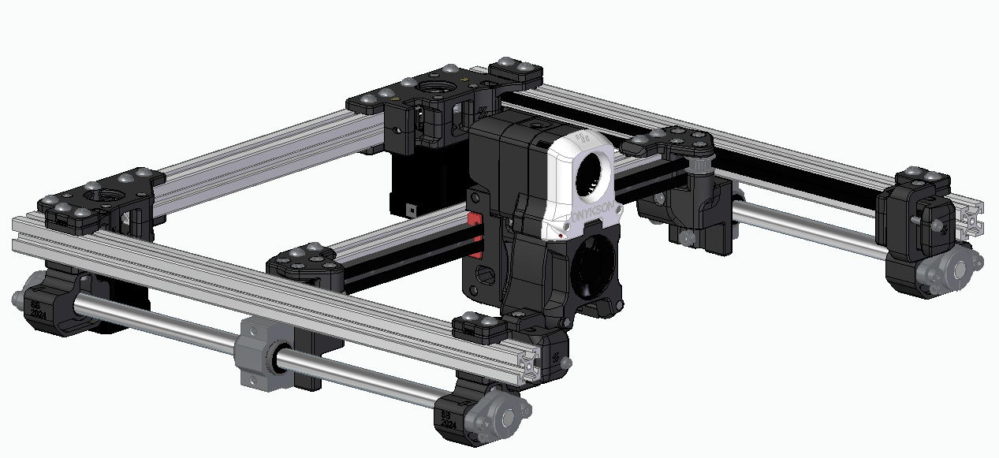
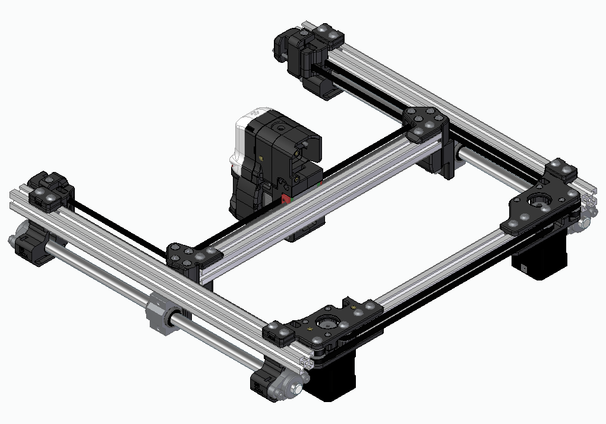

# Drukarka 3D ONYKS
Projekt drukarki 3D Core XY na bazie Voron 2.

## Wykorzystywane modele
- Voron 2 (https://github.com/VoronDesign/Voron-2)
- Voron Afterburner (https://github.com/VoronDesign/Voron-Afterburner)

## TODO
- [ ] Podstawa i rama
- [ ] Oś Z
- [x] Wydruk i montaż głowicy
- [ ] Mod przednich idlerów
- [ ] Mod endstopów
- [x] Modyfikacja złącza prawego
- [x] Modyfikacja złącza lewego
- [x] Model bloków łożysk
- [x] Zamiana bocznych łożysk linowych na okrągłe prowadnice mocowanie na końcach profili kołnierzem
- [x] Wyciągnać boczne profile do przodu o 50 mm

## Gantry

## Autorzy
Szymon Bartosik
